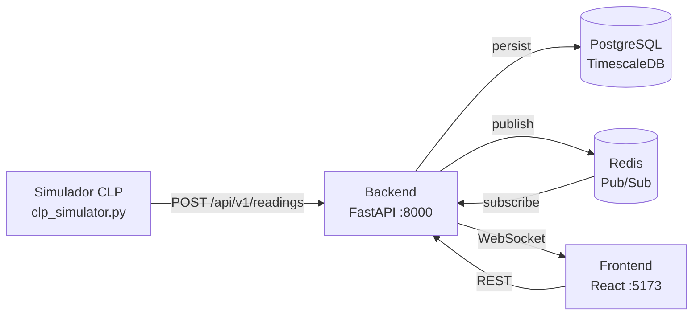

# EH Brewing — Plataforma de Monitoramento de Temperatura

> Monitoramento em tempo real das 8 panelas de fermentação da EH Brewing.
> Stack: FastAPI · PostgreSQL/TimescaleDB · Redis · React · WebSocket.


---

## Visão Geral

A EH Brewing opera 8 panelas de armazenamento de bebidas prontas para fermentação. Este sistema entrega:

- **Monitoramento em tempo real** — temperatura de cada panela via WebSocket
- **Histórico de série temporal** — TimescaleDB para consultas rápidas em qualquer janela de tempo
- **Alertas automáticos** — disparo e resolução quando a temperatura sai da faixa configurada
- **Dashboard web** — React SPA com cards, gráfico histórico e painel de alertas
- **Autenticação com roles** — admin / operador / viewer com tokens JWT revogáveis

---

## Arquitetura



```
[Panelas 1–8]
    ↓ NTC (paralelo ao N321 existente)
[Simulador CLP / CLP Real]
    ↓ HTTP POST a cada 5s
[FastAPI + SQLAlchemy]
    ↓ persiste + publica
[PostgreSQL + TimescaleDB]   [Redis Pub/Sub]
                                  ↓
                         [WebSocket consumers]
                                  ↓
                         [Dashboard React]
```

---

## Quick Start — 3 comandos

> Pré-requisitos: **Docker** e **Docker Compose** instalados.

```bash
# 1. Clone o repositório
git clone https://github.com/Gustavo4Souza/BackendProjectJeagers.git
cd BackendProjectJeagers

# 2. Configure as variáveis de ambiente
cp backend/.env.example backend/.env
cp frontend/.env.example frontend/.env

# 3. Suba todos os serviços
docker compose up -d
```

Após ~30 segundos:

| Serviço | URL |
|---|---|
| API (Swagger UI) | http://localhost:8000/docs |
| Dashboard React | http://localhost:5173 |
| Health check | http://localhost:8000/health |

---

## Setup Local (sem Docker)

### Backend

```bash
cd backend

# Crie e ative o ambiente virtual
python -m venv .venv
source .venv/bin/activate        # Linux/Mac
.venv\Scripts\activate           # Windows

# Instale as dependências de desenvolvimento
pip install -r requirements-dev.txt

# Configure as variáveis de ambiente
cp .env.example .env
# Edite .env com suas credenciais locais

# Aplique as migrations
cd api && alembic upgrade head && cd ..

# Inicie o servidor
cd api && uvicorn main:app --reload --host 0.0.0.0 --port 8000
```

### Frontend

```bash
cd frontend
npm install
cp .env.example .env   # VITE_API_URL=http://localhost:8000
npm run dev            # porta 5173
```

### Simulador de CLP

```bash
# Panelas com temperatura normal
python simulator/clp_simulator.py

# Injetar falha na panela 3 (temperatura forçada a 28°C)
python simulator/clp_simulator.py --fault-tank 3 --fault-temp 28.0

# Apontar para produção
python simulator/clp_simulator.py --api-url https://seu-backend.up.railway.app
```

### Seed de dados iniciais

```bash
python scripts/seed_tanks.py --admin-password admin123
```

---

## Endpoints da API

### Autenticação

| Método | Rota | Descrição | Roles |
|---|---|---|---|
| `POST` | `/register` | Cadastra novo usuário | público |
| `POST` | `/auth/login` | Retorna access + refresh token | público |
| `POST` | `/auth/refresh` | Renova access token | autenticado |
| `POST` | `/auth/logout` | Revoga refresh token | autenticado |

### Tanques

| Método | Rota | Descrição | Roles |
|---|---|---|---|
| `GET` | `/api/v1/tanks` | Lista 8 panelas com temperatura atual | viewer+ |
| `GET` | `/api/v1/tanks/{id}/status` | Temperatura + alertas ativos | viewer+ |
| `GET` | `/api/v1/tanks/{id}/readings` | Histórico (`?period=6h\|24h\|7d\|30d`) | viewer+ |
| `PATCH` | `/api/v1/tanks/{id}/config` | Atualiza nome e faixa de temperatura | admin |

### Leituras e Alertas

| Método | Rota | Descrição | Roles |
|---|---|---|---|
| `POST` | `/api/v1/readings` | Recebe leitura do CLP/simulador | operator+ |
| `GET` | `/api/v1/alerts` | Lista alertas (`?status=active`) | viewer+ |
| `PATCH` | `/api/v1/alerts/{id}/acknowledge` | Reconhece alerta | operator+ |

### Lotes e Leveduras

| Método | Rota | Descrição | Roles |
|---|---|---|---|
| `GET/POST` | `/api/v1/batches` | CRUD de lotes de produção | operator+ |
| `GET` | `/api/v1/batches/{id}/events` | Linha do tempo do lote | viewer+ |
| `GET` | `/api/v1/batches/{id}/export` | Export CSV do lote | operator+ |
| `GET/POST` | `/api/v1/yeast-profiles` | CRUD de perfis de levedura | operator+ |

### WebSocket

| Rota | Descrição |
|---|---|
| `WS /ws/tanks/{id}` | Stream de leituras em tempo real por panela |
| `WS /ws/alerts` | Broadcast de alertas disparados |

### Utilitários

| Método | Rota | Descrição |
|---|---|---|
| `GET` | `/health` | Health check com versão |

---

## Payload de leitura (CLP → API)

```json
POST /api/v1/readings
Authorization: Bearer <token>

{
  "tank_id": 3,
  "temperature": 14.7,
  "recorded_at": "2025-05-15T10:30:00Z"
}
```

---

## Qualidade e Testes

```bash
# Rodar todos os testes com relatório de cobertura
cd backend
python -m pytest tests/ --cov=api --cov-report=term-missing

# Lint Python
python -m ruff check api/

# Lint TypeScript/React
cd frontend && npm run lint

# Teste de carga WebSocket (k6)
k6 run k6/websocket_load_test.js
```

**Cobertura atual:** 86% total (auth.py 100% · database.py 100% · models.py 100% · schemas.py 100% · main.py 81%)

---

## CI/CD

O pipeline GitHub Actions executa automaticamente em todo PR e push para `main`:

```
push/PR → lint-backend ──┐
                          ├── deploy-backend (Railway)  ← apenas push para main
          lint-frontend ──┤
                          ├── build-frontend ──── deploy-frontend (Vercel)
          test-backend ───┘
```

Deploy só ocorre se **todos** os jobs de lint, teste e build passarem.

### Secrets e variáveis necessárias no GitHub

| Chave | Tipo |
|---|---|
| `RAILWAY_TOKEN` | Secret |
| `VERCEL_TOKEN` | Secret |
| `VERCEL_ORG_ID` | Secret |
| `VERCEL_PROJECT_ID` | Secret |
| `RAILWAY_SERVICE_ID` | Variable |
| `VITE_API_URL` | Variable |
| `VITE_WS_URL` | Variable |

---

## Stack Técnica

| Camada | Tecnologia |
|---|---|
| Backend | Python 3.11 + FastAPI (async) |
| ORM | SQLAlchemy 2.x + Alembic |
| Banco de dados | PostgreSQL 16 + TimescaleDB |
| Cache / Pub-Sub | Redis 7 |
| Frontend | React 19 + Vite + TypeScript |
| Gráficos | Recharts |
| Estilização | Tailwind CSS 4 |
| HTTP Client | Axios + React Query |
| Autenticação | JWT (python-jose) + bcrypt |
| Containerização | Docker + Docker Compose |
| CI/CD | GitHub Actions |
| Deploy backend | Railway |
| Deploy frontend | Vercel |
| Testes | pytest + pytest-cov |
| Lint Python | Ruff |
| Lint Frontend | ESLint + TypeScript |
| Teste de carga | k6 |

---

## Estrutura do Repositório

```
BackendProjectJeagers/
├── .github/
│   └── workflows/
│       └── ci.yml              # Pipeline CI/CD
├── backend/
│   ├── api/
│   │   ├── main.py             # FastAPI app, rotas e middleware
│   │   ├── models.py           # Modelos SQLAlchemy
│   │   ├── schemas.py          # Schemas Pydantic v2
│   │   ├── auth.py             # JWT, hash, roles
│   │   ├── database.py         # Engine + SessionLocal
│   │   └── migrations/         # Alembic migrations
│   ├── tests/                  # pytest — 132 testes, 86% cobertura
│   ├── Dockerfile              # Python 3.11, entrypoint com migrations
│   ├── railway.json            # Config deploy Railway
│   ├── requirements.txt        # Deps de produção
│   ├── requirements-dev.txt    # Deps de desenvolvimento
│   └── entrypoint.sh           # alembic upgrade head + uvicorn
├── frontend/
│   ├── src/
│   │   ├── components/         # TankGrid, TankCard, AlertPanel...
│   │   ├── hooks/              # useWebSocket, useTanks, useAlerts...
│   │   ├── pages/              # Dashboard.tsx, Login.tsx
│   │   ├── services/           # Axios services
│   │   └── types/              # Tipos TypeScript
│   └── vercel.json             # SPA rewrites para React Router
├── simulator/
│   └── clp_simulator.py        # Simulador de CLP (8 panelas)
├── k6/
│   └── websocket_load_test.js  # Teste de carga: 8 VUs, 30s
├── scripts/
│   └── seed_tanks.py           # Seed inicial: 8 panelas + admin
├── docker-compose.yml          # Ambiente local completo
├── .gitignore
└── README.md
```

---

## Variáveis de Ambiente

### Backend (`backend/.env`)

| Variável | Descrição | Exemplo |
|---|---|---|
| `DATABASE_URL` | Connection string PostgreSQL | `postgresql+psycopg2://user:pass@db:5432/eh` |
| `REDIS_URL` | URL do Redis | `redis://redis:6379/0` |
| `JWT_SECRET_KEY` | Chave secreta para JWT — gerar com `openssl rand -hex 32` | — |
| `ACCESS_TOKEN_EXPIRE_MINUTES` | Validade do access token | `15` |
| `REFRESH_TOKEN_EXPIRE_DAYS` | Validade do refresh token | `7` |

### Frontend (`frontend/.env`)

| Variável | Descrição | Exemplo |
|---|---|---|
| `VITE_API_URL` | URL base da API | `http://localhost:8000` |
| `VITE_WS_URL` | URL base dos WebSockets | `ws://localhost:8000` |

---

*EH Brewing — Projeto Integrador · 7°/8° Período · 2025*
